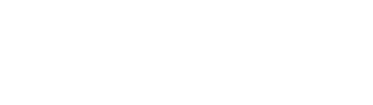
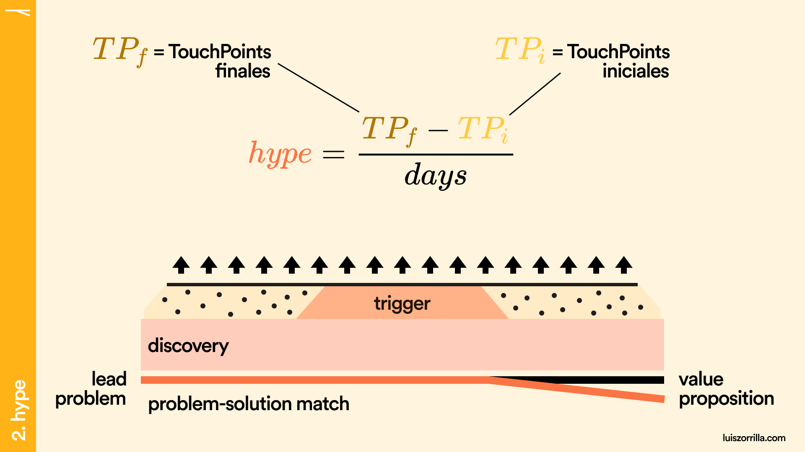

# 🏁 Abstract

Si utilizas un embudo tradicional como framework, basas tus métricas en un modelo creado en 1910. Y este _statement_ es mucho más duro que sensionalista.

<figure><figcaption></figcaption></figure>

Tengo varios meses cuestionándome algún entorno que me permita conocer casi a la perfección los procesos de compra de los leads hasta convertirse en clientes.

La única respuesta que he encontrado es que **el funnel limita el entendimiento sobre los procesos de compra**, y mucho...

Cree un modelo que permite definir las bases de un proceso de compra a una macro y micro escala, entendiendo a detalle los contextos en cada etapa.

## Vulcan Growth Model

El framework que propone el modelo Vulcan consta de 4 vertientes principales:

<figure><figcaption>
Ventajas del Vulcan Growth Model
</figcaption></figure>

#### &#x20;<mark style="background-color:orange;">Problem-based funnel</mark>&#x20;

El modelo vgm propone una precuela del funnel de ventas. ¿Qué hace el lead hasta llegar al funnel? Vio un ad, ¿en que proceso mental estaba cuando lo vio?. Toma en cuenta el timing y conoce el núcleo del pain.

#### &#x20;<mark style="background-color:yellow;">Hype</mark>&#x20;

Medir la cadencia en la que el lead recibe contexto sobre tu solución es importante, pero medir la aceleración con la que el lead interactúa con tu funnel por dimension otorga una visión única del mismo.

#### &#x20;<mark style="background-color:green;">Depth</mark>&#x20;

Un funnel es un conjunto de etapas por las que pasa el lead. Pero ¿qué tan seguido un lead cumple con esas etapas en el orden correcto?. ¿Todos empiezan por el inicio y salen al final? Identifica la profundidad de tu funnel con un concepto en 3D.

#### &#x20;<mark style="background-color:purple;">mNql</mark>&#x20;

Tienes ventas. Excelente. Pero ¿qué porcentaje de las ventas fueron realizadas por leads de calidad?. Define que es un lead de calidad, y sobre todo, abstrae a los leads carentes de calidad (en un inicio) que resultaron compradores.

## Procesos de Compra

El proceso mental de cada lead es único y no se puede canalizar en un funnel lineal, pero los estudios recientes nos indican que todos convergen en la _**libertad que buscan al entrar a un proceso de compra**_, por ejemplo este estudio de Zendesk, donde se indica que [el 67 % de los clientes](https://www.zendesk.com/blog/searching-for-self-service/) prefieren el autoservicio a hablar con un representante de la empresa.


En un estudio de [Pew Internet](https://www.pewresearch.org/) se concluyo que el 92% de los adultos online utilizan motores de búsqueda para encontrar información en la web, el 59% de ese grupo lo hace en un día típico. Esto nos indica que los usuarios esperan la misma funcionalidad en cualquier sitio que visiten.


Existe una estructura básica sobre el proceso de toma de decisiones de los humanos como consumidores:

1. **Reconocimiento del problema;** un _trigger_ detona un problema, lo cuál me lleva a reconocer una necesidad de un producto o servicio.
2. **Búsqueda de información;** recopilo información sobre la solución a mi problema.
3. **Evaluación de alternativas;** evalúo las opciones que cumplan con mis requisitos y limitaciones, y las comparo.
4. **Decisión de compra (**_**MoP "Moment of Purchase"**_**);** realizo la compra.
5. **Etapa post-compra;** evalúo posterior a la compra y reflexiono sobre la misma.

Entendiendo el proceso mental podemos crear un framework, el [**vulcan growth model**](https://app.gitbook.com/o/VdWI8br0I4LnSbZvx7Pv/s/Y87J3k27L3F0DnztiFNY/)**:**&#x20;

<figure><figcaption></figcaption></figure>

No definimos el _main funnel_, pero sí su estructura; una que toma en cuenta el _trigger_, que crea un problema y activa la búsqueda de soluciones, detecta el choque del problema con la solución, dando entrada al lead al _main funnel_ (el cuál no hemos definido aún) y lo sigue hasta convertirlo en cliente de calidad (o no calificado).

## Etapas

Para el [**vulcan growth model**](./) no existe 1 solo funnel, pero si define la estructura que necesitan tener (todos) los que existen.

Los stages de un funnel, según el **vgm**, son un espejo de los 5 etapas de compra de un consumidor.

1. Existe un problema que detona.
2. Busco información sobre la solución a mi problema.
3. Selecciono la mejor solución comparando.
4. Compro.

<figure><figcaption></figcaption></figure>

Pongamos como ejemplo a Raúl, tiene un problema respecto a las suscripciones que tiene en servicios digitales de streaming como Spotify, Netflix y Disney+. Tiene tiempo siendo usuario de tantas plataformas que perdió la cuenta de cuanto gasta en suscripciones.

<figure><figcaption>
Reconocimiento del problema
</figcaption></figure>

Las maneras de solucionar su problema por su propia cuenta no son sencillas ni rápidas. Pero son opciones, y son las primeras que vienen a su mente. Revisar su estado de cuenta bancario y registro por registro detectar las suscripciones, decidiendo que hacer con cada una de ellas una por una; puede tomar nota el próximo mes sobre los cobros que le vaya notificando el banco y detecte que venían de una de estas plataformas; puede revisar su correo buscando las plataformas y anotando los recibos de pago, etc...

<figure><figcaption>
Posibles auto-soluciones
</figcaption></figure>

Pero este problema, sea cual sea la solución, tiene su raíz en un trigger, ese momento de realización sobre la existencia del problema.

<figure><figcaption>
Posibles triggers
</figcaption></figure>

Tanto la realización del problema como el trigger son iguales de relevantes para el contexto del lead. A final de cuentas estos funcionan como catalizadores de soluciones imaginarias en el entorno de ese contexto.

En base a este proceso mental definiremos las etapas o **stages**.

## VGM Funnel Framework

<figure><figcaption>
VGM Funnel
</figcaption></figure>

El **VGM Funnel es un **_**framework**_** de un funnel**, un template, ironicamente **no es un funnel**. Define 5 etapas cuyo contenido será definido por tu contexto como empresa y el contexto del lead.

### ¿Cómo crear un funnel?

1. Identifica las 5 etapas del framework (discovery, trigger, research, selection y MoP)
2. Mapea el problema de tus leads, el más fuerte, el que más cueste solucionar.
   1. Opcional. Encuentra patrones en el trigger. Situaciones que detonen el problema.
3. En base a tu paso 2, anota bajo que contextos se encuentran en las etapas: discovery, research y selection.&#x20;
   1. Por ejemplo, en la etapa discovery, el lead simplemente me encontró explorando por la web, ó me encontró por que tuvo una mala experiencia, ó me encontró por que se imagino algo como mi solución y lo busco en Google, etc...
4. Define los touchpoints para cada contexto.
   1. Siguiendo con el ejemplo, los que me encontraron explorando en la web tal vez tuvieron su primer contacto con cierta landing page ó buscando en un sitio de alternativas a productos; para los que me encontraron por una mala experiencia, tal vez me encontraron en foros o en alguna sección de reseñas; y para los que me encontraron buscando en Google tal vez fue por GoogleMyBusiness o por Youtube de manera orgánica...
5. ¡Felicidades! Ahora tienes un funnel.

Muy empírico y basado en la intuición, pero tienes un funnel.

Si bien mapear un funnel completo no es vital en esta etapa del modelo, el punto inicial que te da este ejercicio es sumamente importante y vital. Es tu punto cero.

Ahora te explico a lo que me refiero con [**hype** ](hype/)y como afecta a tu funnel.

## Hype

El **hype**, para el vulcan model, es la cadencia que tiene un lead con tus _touchpoints_ en un periodo de tiempo definido. Para este punto conoces que el lead tiene un _trigger_ que detona un problema, el cual lleva a una solución, pero este _statement_ puede durante meses o incluso años en llevarse a cabo.

Para esto funciona el **hype**, te permite medir la cantidad de emoción que se genera entorno a tu empresa como solución de mi problema.

<figure><figcaption>
Gravedad del trigger, fórmula de aceleración en física.
</figcaption></figure>

La gravedad del _trigger_ puede influir directamente en el _hype_ de tu funnel.

Si tu producto es un SaaS que resuelve un problema en la industria de los seguros de gastos médicos, puede que un _trigger_ de emergencia médica en la familia detone en la adquisición de tus servicios en una distancia de tiempo muy estrecha con el _trigger_.

Si ofreces servicios de Marketing para startups puede ser que el _trigger_ se genere después de 4 meses de consumir tu podcast, pero cierres el contrato en muy pocos días y muy pocas juntas, por el mismo conocimiento que el lead tiene sobre ti y tu empresa.

Las situaciones son infinitas, pero el _**hype**_ no.

### Hype Score

La **fórmula del hype** es una comparación directa con la [fórmula de aceleración](http://hyperphysics.phy-astr.gsu.edu/hbasees/mot.html) en física.

<figure><figcaption></figcaption></figure>

**"TP"**, o [_touchpoints_](hype/touchpoints.md), se refieren a los puntos de contacto que tiene un lead con tu empresa. Estos _touchpoints_ le dan contexto sobre tu solución al lead para resolver su problema.

La "**f**" y la "**i**" después de los "**TP**" se refieren a los _touchpoints_ **finales** e **iniciales**.

Los **días** hacen referencia al tiempo que tardo en convertirse el lead.

<figure><figcaption>
Hype fórmula
</figcaption></figure>

Todos los _touchpoints_ que tenga el lead con mi producto integral durante la **etapa de discovery**, son considerados **TP iniciales**.

Todos los _touchpoints_ que tenga el lead con mi producto integral durante el **momento de compra** (mop), son considerados **TP finales**.

<figure><figcaption>
Touchpoints para TPf y TPi
</figcaption></figure>

Suponiendo que en la etapa de research tenemos **3 TPs** (anuncios en redes, una excelente tabla de pricing y un website robusto) y en la etapa final tenemos **12 TPs** (como una conversación por whatsapp o la descarga de un infográfico), en **5 días** de proceso total de compra, podemos calcular un **hype de 1.4 TPs / día**.

<figure><figcaption>
Ejemplo, cálculo del hype
</figcaption></figure>

### Interpretando el Hype

**Un hype > 1**, nos indica que tu lead va recibiendo más información conforme se va adentrando en tu solución.

**Un hype de 1,** nos indica que el problema de tu lead es algo cotidiano y esta presente en la mayoría de sus días.

**Un hype < 1,** nos indica que el lead interactúa muy poco en el proceso, ó que tu proceso de compra es muy largo.

**Un hype negativo,** nos indica que el lead tuvo un problema que no se repite a menudo, hubo un rush al inicio por tener información sobre tu solución, pero no perduró con el tiempo.


El hype es más un score que una métrica. El hype refiere a un proceso dosificado y creciente de touchpoints en un rango de tiempo. El resultado del score hype, refleja que tan bien se cumple ese efecto.


Ahora conociendo qué es el hype, para que funciona, como se calcula y como interpretar su resultado, pasamos a analizar el momento clave del proceso, el _trigger_.

### Trigger

El _**trigger**_ es el momento de realización del problema.

<figure><figcaption>
Trigger, en el vulcan funnel.
</figcaption></figure>

El trigger convive directamente con el proceso mental, es el que crea el proceso mental en donde nuestro producto toma parte.

En una [encuesta reciente de McKinsey](https://hbr.org/2016/09/know-your-customers-jobs-to-be-done), el **84%** de los c-class globales informaron que **la innovación era extremadamente importante para sus estrategias de growth**, pero un **94% no estaba satisfecho con el desempeño de innovación de sus organizaciones**.

Es curioso como entre más información tenemos año con año de nuestros posibles clientes, menos los conocemos. Entre más grande es la base de datos, mayor complejidad en encontrar un solo insight de valor. Y esto pasa cuando no nos hacemos las preguntas correctas.


#### Que por cierto, tengo un framework sobre como hacerte solo las preguntas correctas a la hora de experimentar.  [Ollivander](https://app.gitbook.com/o/VdWI8br0I4LnSbZvx7Pv/s/shgoesDA9ytmPVbuoMzK/ "mention")


#### La pregunta correcta aquí **no es** cuál es "el _**problema"**_, **es** conocer cual es "el _**trigger"**_. 

Si puedo ser capaz de detectar el trigger que detono tu problema, puedo ser capaz de moldearte un camino "ideal" por el cuál atravesar y comprar mi solución.

Si pienso en el "job-to-be-done" o el problema, pierdo el contexto de la situación.

Ejemplifiquemos un poco, tomando un gimnasio como ejercicio:




JTBD = "Quiero sentirme joven."

Este problema puede ser un buen problema para ser solucionado por un gimnasio.

Podría crear un funnel basado en como el lead investiga, compara y se suscribe a un gimnasio.

Como ese funnel tiene sentido y lógica, puedo identificar al gimnasio como una muy buena solución a ese problema.



Trigger = "Tengo arrugas"

JTBD = "Quiero sentirme joven."

Puedo definir un funnel como el del gimnasio, así como puedo definir un medicamento, un tratamiento, una cirugía plástica, un kit de mascarillas o una rutina de yoga.

Ese es el punto, **el contexto es el rey.**



Los _touchpoints_ que otorgarás a cada etapa dependen del funnel que formes para cada solución y como dosificas el contendo y el valor a través del tiempo para los leads.

### Touchpoints

Un **touchpoint** es un momento en el que un cliente interactúa con una empresa o marca.&#x20;

Por ejemplo, cuando un niño ve un anuncio de juguete en la televisión, ese es un touchpoint. Otra vez cuando el niño va a la tienda y ve el juguete en la estantería, es otro touchpoint. Incluso cuando el niño juega con el juguete en su casa, es otro touchpoint. Cada vez que el niño tiene alguna interacción con el juguete o la marca del juguete, es un touchpoint. Los marketeros utilizan esta información para entender cómo los clientes interactúan con la marca y cómo pueden mejorar su experiencia.

Si pudieramos clusterizar efecivamente los _touchpoints ****_ los dividiriamos en dos:

1. Inbound; es un momento en el que un cliente se acerca a una empresa o marca de forma activa, en lugar de ser contactado por la empresa. Por ejemplo, cuando un niño busca en internet un juguete que quiere comprar, ese es un touchpoint inbound. Otra vez cuando el niño le pregunta a su amigo sobre el juguete, es otro touchpoint inbound.&#x20;

Los **touchpoints inbound** son aquellos en los que el cliente toma la iniciativa de interactuar con la marca, en lugar de ser contactado por la marca

2. Outbound; es un momento en el que una empresa o marca se acerca a un cliente de forma activa, en lugar de esperar a que el cliente se acerque a ellos. Por ejemplo, cuando una empresa envía un correo electrónico promocionando un juguete, ese es un touchpoint outbound. Otra vez cuando una empresa hace un anuncio en televisión del juguete, es otro touchpoint outbound.&#x20;

Los **touchpoints outbound** son aquellos en los que la empresa toma la iniciativa de interactuar con el cliente, en lugar de esperar a que el cliente interactúe con ellos.

## Leads

**Se pueden calcular entrevistando a una muestra de usuarios por channel y evaluando en un rango 1-100% la correlación entre los intereses del lead vs los intereses buscados.**

<figure><figcaption>
mNql // mql
</figcaption></figure>

Es importante conocer a los leads que convertimos en clientes, pero es aún más importante entender a los leads no calificados que lo hacen.

### Medición

De la lista total de leads que se convirtieron en clientes ¿Cuántos pertenecen a la segmentación de características e intereses que buscabas?

Es tedioso, pero este análisis nos permite encontrar esa piedra en el arroz que puede estar poco a poco disfrazando las métricas como exitosas cuando en realidad las conforman clientes que otorgan poca o nula retención a través del tiempo (Lifetime Value).

### mNql

Imagina que tienes un negocio de venta de zapatillas deportivas, y has estado promoviendo tu sitio web a través de anuncios en línea. Muchas personas han visitado tu sitio web, pero solo unas pocas han completado un formulario de contacto o han descargado un recurso valioso que ofreces. Estas personas son tus leads calificados, ya que han demostrado interés en tus zapatillas deportivas y han tomado acción para convertirse en un cliente potencial.

Pero, hay muchas otras personas que han visitado tu sitio web, pero todavía no han tomado ninguna acción para convertirse en un lead calificado.&#x20;

Estas personas son tus mNql, o tus Marketing Non Qualified Leads. Aunque todavía pueden ser una oportunidad potencial de ventas, todavía necesitan ser "calificados" antes de ser considerados un Lead potencial.

Entonces, como dueño del negocio, debo seguir trabajando en convertir estos mNql en leads calificados, mediante la segmentación de mi publico, la comunicación adecuada y la oferta de contenido relevante para poder convertirlos en clientes potenciales y aumentar las posibilidades de ventas.

### mql

Ahora imagina que tienes un negocio de venta de zapatillas deportivas, y has estado promoviendo tu sitio web a través de una estrategia de contenido. Muchas personas han visitado tu sitio web y han completado un formulario de contacto o han descargado un recurso valioso que ofreces, como una guía para elegir la mejor zapatilla para correr.&#x20;

Estas personas son tus Marketing Qualified Leads, ya que han demostrado interés en tus zapatillas deportivas y han tomado acción para convertirse en un cliente potencial.

Estos leads calificados son muy valiosos para mi, ya que ya han mostrado un interés específico en mis productos y han demostrado estar en una etapa avanzada del proceso de compra, por lo que es más probable que se conviertan en clientes.&#x20;

Entonces, debo seguir trabajando en nutrir a estos leads calificados, mediante la personalización de la comunicación, ofreciendo contenido relevante y ofertas especiales para atraerlos a tomar la acción deseada.

## Profundidad

La profundidad (_**"depth"**_) es una suma de los puntos de contacto ([_touchpoints_](hype/touchpoints.md)) por canal por etapa desde que se produce el [_trigger_](hype/trigger.md).

Un [funnel tradicional](fundamentals/marketing-funnel.md) infiere que el lead atraviesa de manera lineal y metódica un proceso, lo cuál hemos comprobado anteriormente que no es así.

<figure><figcaption>
Profundidad gráfica.
</figcaption></figure>

Un cliente puede iniciar el proceso al inicio, a la mitad o casi al final del funnel, no es un proceso lineal. Así también puede terminarlo donde su proceso lo desee. Puede realizar la compra justo después de ver tu anuncio de Facebook sin antes haber realizado comparativa. No necesariamente atraviesa el funnel completo.

Si desglosamos la imagen podemos partir el modelo en **3 dimensiones**:

<figure><figcaption>
Tres ejes del vulcan funnel.
</figcaption></figure>

Los pasos o _**steps** _ (x) son las etapas del main funnel; los ** **_**leads**_ (y) atravesando las etapas; y, los canales o _**channels**_ (z) son comunes denominadores de procesos mentales del lead.

Te explico a detalle cada uno utilizando una herramienta...

### Matriz de Volumen

La **matriz de volumen** es una herramienta diseñada para mapear los _canales_ dentro de cada _etapa_ del [_main funnel_](fundamentals/vgm-funnel.md).



### Canales

Los ** **_**channels**_ son distribuidos por _step_ o etapa, es decir, en el _step_ ‘**discovery**‘ tendré procesos mentales de los leads al estar en esta etapa.Por ejemplo, leads que tuvieron malas experiencias y buscan una solución, leads que se basan en la curiosidad, etc…En este paso no tomes mucho tiempo, lo importante es dividir segmentos.Ahora sí..

<figure><figcaption>
Matriz de Volumen
</figcaption></figure>

### Touchpoints por channel 

Llenamos la herramienta con algún símbolo que caracterice a nuestro channel.En este caso, un planeta para los que llegar explorando, un gesto negativo para los que tuvieron una mala experiencia externa, un zapato de tacón para los que llegan buscando el producto bajo un deseo, etc…

<figure><figcaption>
Touchpoints por canal
</figcaption></figure>

### new, bye y mop

Llenamos nuestra matriz con los _**new**_, _**bye**_ y _**mop**_. Te explico que son con el ejemplo del canal **«explorando»** en la matriz de arriba:

<figure><figcaption></figcaption></figure>

_**new**_** = Leads que entran al funnel explorando su problema**

Un lead que, buscando en Google sobre tu industria, encontró una entrada de blog interesante en tu sitio web.

_**bye**_** = Leads que salen del funnel explorando su problema**

Un lead que tuvo contacto en la etapa de exploración sobre su problema, pero nos ignoró.

_**mop**_** = Leads que compran explorando su problema.**

Un lead que compro directamente sin interacción previa.

## iVulcan

<figure><figcaption></figcaption></figure>

<figure><figcaption></figcaption></figure>

#### Índice de Vulcan 

El _índice de vulcan_, _**** ó ****_** iVulcan**, es un cociente que ayuda a predecir el engagement o la efectividad de un canal.Imagina que en mi empresa corro la matriz de vulcan, y mapeo que en cierto canal tengo 10 compras. Estoy contento con ese output, pero no entiendo realmente el contexto bajo el que se crean esas 10 compras. ¿10 compras es mucho o es poco?.Es justo esa pregunta la que responde el índice de vulcan, te ofrece un contexto sobre la viralidad, el engagement, la efectividad de un canal.Si tu matriz se ve así, estás listo para calcularlo.Calcular el **iVulcan** es muy sencillo.Solo reemplaza la fórmula con tus _**new**_, _**bye**_ y _**mop**_ x cada channel.

<figure><figcaption></figcaption></figure>

### Interpretación 

El índice de Vulcan es un cociente, entre más se acerque al 1, más cerca de un canal perfecto en efectividad.

Si tengo 27 _new_, 0 _bye_ y 27 _mop_, tengo un canal tan _efectivo_, que tiene la misma cantidad de leads nuevos como convertidos.

<figure><figcaption>
Balance
</figcaption></figure>

El ejemplo opuesto es un canal desbalanceado o _inefectivo_.

<figure><figcaption>
Desbalance
</figcaption></figure>

Al ir llenando cada uno, tendremos una matriz terminada.

<figure><figcaption></figcaption></figure>

## Vulcan Matrix

<figure><figcaption></figcaption></figure>

Te dejo un spreadsheets para que clones el proyecto.

## Matriz de Vulcan 

<table data-view="cards"><thead><tr><th></th><th data-type="content-ref"></th><th data-hidden data-card-cover data-type="files"></th></tr></thead><tbody><tr><td>Matriz de Vulcan</td><td><a href="https://docs.google.com/spreadsheets/d/1qKcJbaMotkwLeKZLip5ZWG4Wlym3-23aM0sV1lyquD8/edit?usp=sharing">https://docs.google.com/spreadsheets/d/1qKcJbaMotkwLeKZLip5ZWG4Wlym3-23aM0sV1lyquD8/edit?usp=sharing</a></td><td><a href=".gitbook/assets/Frame 54 (2).png">Frame 54 (2).png</a></td></tr></tbody></table>

Dividimos por step…

_**¿Entre «**explorando**», «**mala experiencia**» y «**me gustaría…**» cuál obtuvo una mayor** iVulcan**?**_

<figure><figcaption></figcaption></figure>

<figure><figcaption></figcaption></figure>

Llenamos la matriz con los índices de Vulcan más fuertes por step…Canales balanceados por matriz.Ya que tenemos nuestra matriz de Vulcan completa, pasamos a la analizarla.Calcularemos 5 valores que nos permitirá definir...

1. Que tan tanto se consume cada canal.
2. Que canal es el más balanceado.
3. La dispersión del índice respecto al funnel completo.
4. La diferencia del canal vs la media.

O también podemos etiquetar los valores como:

1. Promedio
2. Mediana
3. Desviación estándar
4. Varianza

La moda es un valor que no utilizaremos, por que los canales pueden tener resultados muy distantes y específicos como para clusterizar los resultados.

<figure><figcaption></figcaption></figure>

## Resultados Finales 

### Promedio 

Un **promedio de 1**, refleja un **funnel perfecto**; un **promedio en 0**, refleja un **funnel perfectamente balanceado**; y un **promedio negativo** nos indica un **funnel ineficiente** y desbalanceado.El promedio es una especie de valoración general de la matriz (o funnel).

### Mediana 

La **mediana** nos **ubica** a **la columna vertebral del funnel**, pueden ser 1 o más canales.

### Varianza 

La varianza captura en que medida los datos están en torno a la media. Si tenemos canales muy por encima y muy por debajo de la media, esta será menos representativa y lo veremos reflejado en una varianza muy elevada.

### Desviación Estándar 

Una desviación estándar baja indica que la mayor parte de los canales de la matriz tienden a estar agrupados cerca de su media, mientras que una desviación estándar alta indica que los canales se extienden sobre un rango mucho más amplio.

Estos valores nos llevan a interpretar hasta el más mínimo detalle de cada canal, permitiéndonos experimentar con los que tengan baja efectividad y tratar de emular la experiencia que ofrecen los canales con una alta efectividad.

Ahora que tienes un mapa completo de cada canal, los has medido, evaluado y obtenido un score para comparar su rendimiento, toca **experimentar.**

Este modelo te permite pulverizar un volcán en pequeñas partes, evaluar cada una de las piezas, reconstruir un volcán mucho más efectivo y ponerlo en erupción el siguiente mes...

​¿Y si lo medimos y mejoramos por hora?​

## Conclusiones

El nivel de detalle al que llegamos es tan profundo que podemos variar en la periodicidad del ejercicio y sigue teniendo buenos resultados. Además el modelo es agnóstico al presupuesto, por lo que puedes probar el Vulcan Growth Model con solo touchpoints orgánicos.

Los visión al ver todo desde la óptica del trigger es mucho más precisa y permite identificar puntos débiles muy específicos, mejorarlos y medir esa mejora. También te permite detectar los touchpoints y canales que son la columna vertebral de toda tu estrategia de marketing.

El valor del framework está en la personalización del funnel, pero en la libertad para construirlo, todo enfocado a números, métricas, resultados.

Este framework no busca ser una verdad absoluta, si no lo contrario. Este modelo esta abierto a modificaciones y tú mismo puedes aportar al proyecto.

Gracias por leer.

**Luis Zorrilla,** [**luiszorrilla.com**](https://luiszorrilla.com)****

_lc@luiszorrilla.com_

_**Agradecimiento a**_ [_**Fernando Huerta**_](https://www.linkedin.com/in/fernando-huerta-zuniga/) _**por su significativa aportación en el índice de Vulcan y la medición de la matriz.**_
