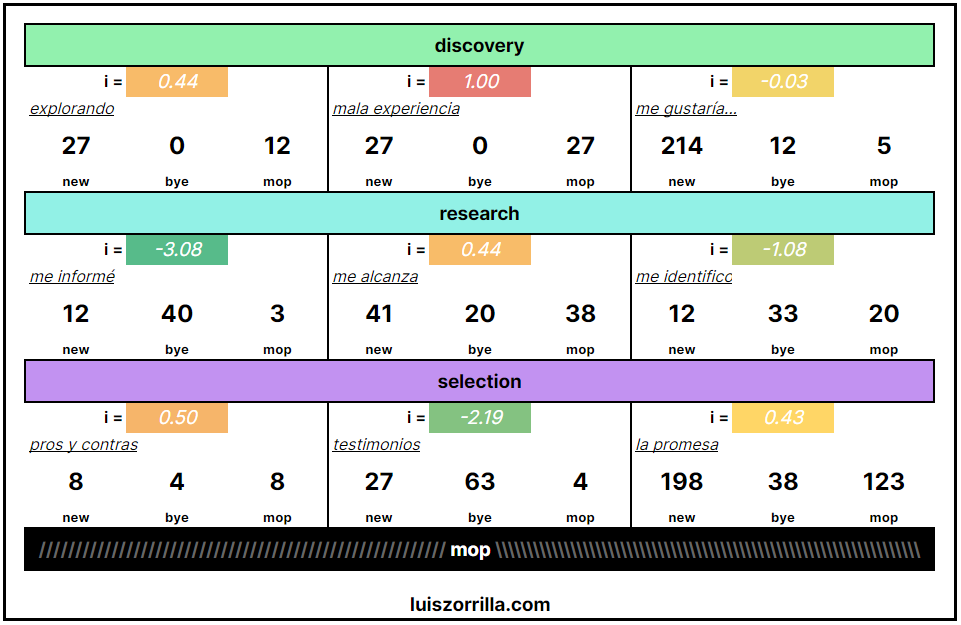

# iVulcan

<figure><figcaption></figcaption></figure>

<figure><figcaption></figcaption></figure>

## Índice de Vulcan

El _índice de vulcan_, _**** ó ****_** iVulcan**, es un cociente que ayuda a predecir el engagement o la efectividad de un canal.&#x20;

Imagina que en mi empresa corro la matriz de vulcan, y mapeo que en cierto canal tengo 10 compras. Estoy contento con ese output, pero no entiendo realmente el contexto bajo el que se crean esas 10 compras. ¿10 compras es mucho o es poco?.

Es justo esa pregunta la que responde el índice de vulcan, te ofrece un contexto sobre la viralidad, el engagement, la efectividad de un canal.

Si tu matriz se ve así, estás listo para calcularlo.

<figure><figcaption></figcaption></figure>

Calcular el **iVulcan** es muy sencillo.

Solo reemplaza la fórmula con tus _**new**_, _**bye**_ y _**mop**_ x cada channel.

## Interpretación

El índice de Vulcan es un cociente, entre más se acerque al 1, más cerca de un canal perfecto en efectividad.

<figure><figcaption>
Ejemplo balance
</figcaption></figure>

Si tengo 27 _new_, 0 _bye_ y 27 _mop_, tengo un canal tan _efectivo_, que tiene la misma cantidad de leads nuevos como convertidos.

El ejemplo opuesto es un canal desbalanceado o _inefectivo_.

<figure><figcaption>
Ejemplo desbalance
</figcaption></figure>

Al ir llenando cada uno, tendremos una matriz terminada.

<figure><figcaption></figcaption></figure>

Te dejo el template en el siguiente bloque...
