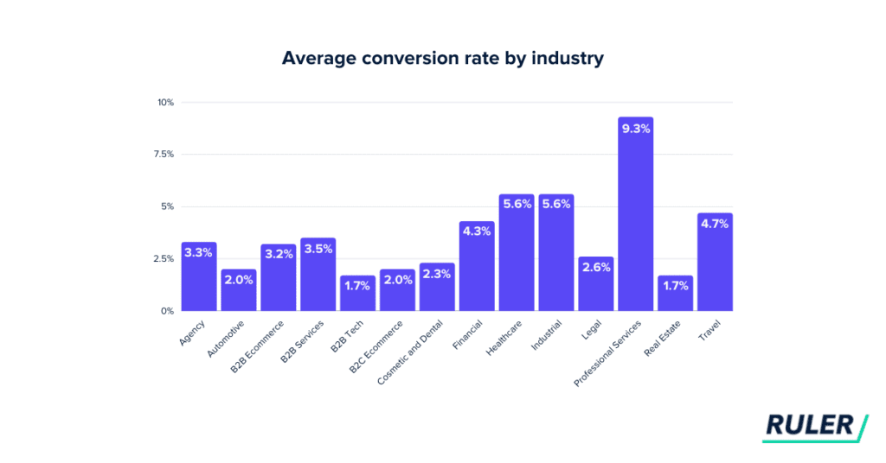

# Marketing Funnel

Un **embudo de marketing** representa visualmente el viaje que realiza una persona desde el momento en que interactúa con su marca, como leer una publicación de blog, hasta el momento en que realiza una compra. Los embudos de marketing incluyen diferentes etapas que corresponden a diferentes puntos en ese viaje.&#x20;

La parte más ancha del embudo captura al mayor grupo de personas que podrían estar interesadas en lo que vendes. A medida que interactúa con estas personas a través de actividades de marketing o comunicación directa, avanzan por el embudo hasta que dejan o compran su producto.

<figure><figcaption>
Funnel tardicional de marketing
</figcaption></figure>

Las carencias principales de un embudo se centran en opacar todo lo que está fuera de él. Además que no toma en cuenta que tan rápido los leads completan el flujo, distintos canales e interacciones y concentra todo su esfuerzo en _awareness_. **¿Pondrías el mayor esfuerzo en la parte del proceso que debería de ser sencilla y automática?**. Hoy en día el «awareness» se consigue con 1-clic.

<figure><figcaption></figcaption></figure>

Y con mayor esfuerzo hacemos referencia al hecho de que las demás etapas se convierten en un filtro del awareness. Si fueras una empresa que convierte el 100% de los leads que tienen un contacto directo contigo, el número máximo de clientes que tendrías sería tu awareness; con eso en mente, ese 100% al ser reemplazado por las [medias de la industria](#user-content-fn-1)[^1] (siguiente imagen) nos daremos cuenta que el promedio no es prometedor al hablar de resultados.

<figure><figcaption>
Tasa de conversión promedio por industria (2021)
</figcaption></figure>

[^1]: Reference: [https://www.ruleranalytics.com/blog/insight/conversion-rate-by-industry/](https://www.ruleranalytics.com/blog/insight/conversion-rate-by-industry/)
