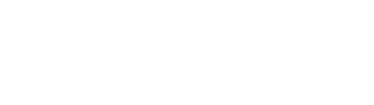
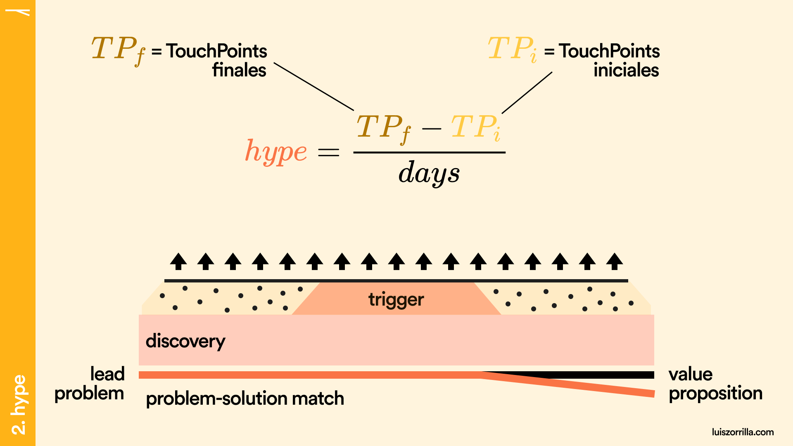
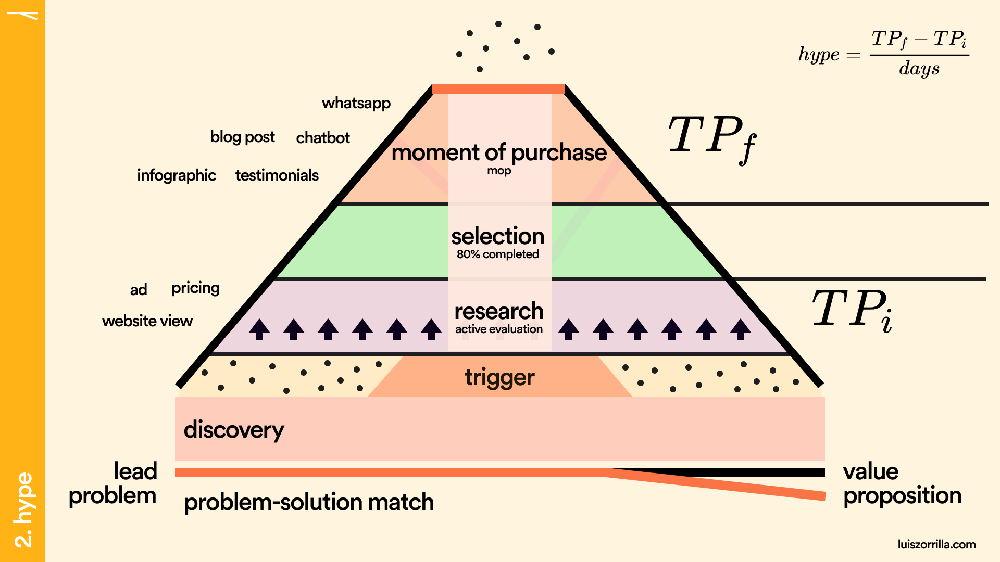

# Formula

La **fórmula del hype** es una comparación directa con la [fórmula de aceleración](http://hyperphysics.phy-astr.gsu.edu/hbasees/mot.html) en física.

<figure><figcaption></figcaption></figure>

**"TP"**, o _touchpoints_, se refieren a los puntos de contacto que tiene un lead con tu empresa. Estos _touchpoints_ le dan contexto sobre tu solución al lead para resolver su problema.

La "**f**" y la "**i**" después de los "**TP**" se refieren a los _touchpoints_ **finales** e **iniciales**.

Los **días** hacen referencia al tiempo que tardo en convertirse el lead.

<figure><figcaption>
Hype fórmula
</figcaption></figure>

Todos los _touchpoints_ que tenga el lead con mi producto integral durante la **etapa de discovery**, son considerados **TP iniciales**.

Todos los _touchpoints_ que tenga el lead con mi producto integral durante el **momento de compra** (mop), son considerados **TP finales**.

<figure><figcaption>
Touchpoints para TPf y TPi
</figcaption></figure>

Suponiendo que en la etapa de research tenemos **3 TPs** (anuncios en redes, una excelente tabla de pricing y un website robusto) y en la etapa final tenemos **12 TPs** (como una conversación por whatsapp o la descarga de un infográfico), en **5 días** de proceso total de compra, podemos calcular un **hype de 1.4 TPs / día**.

<figure><figcaption>
Ejemplo, cálculo del hype
</figcaption></figure>

## ¿Qué demuestran los resultados del _hype_?

**Un hype > 1**, nos indica que tu lead va recibiendo más información conforme se va adentrando en tu solución.

**Un hype de 1,** nos indica que el problema de tu lead es algo cotidiano y esta presente en la mayoría de sus días.

**Un hype < 1,** nos indica que el lead interactúa muy poco en el proceso, ó que tu proceso de compra es muy largo.

**Un hype negativo,** nos indica que el lead tuvo un problema que no se repite a menudo, hubo un rush al inicio por tener información sobre tu solución, pero no perduró con el tiempo.

Ahora conociendo qué es el hype, para que funciona, como se calcula y como interpretar su resultado, pasamos a analizar el momento clave del proceso, el _trigger_.
